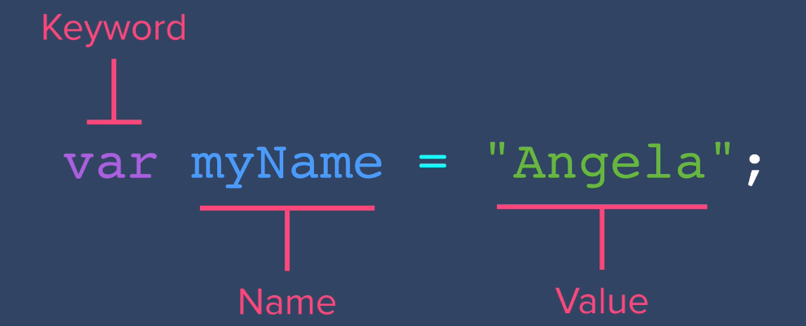
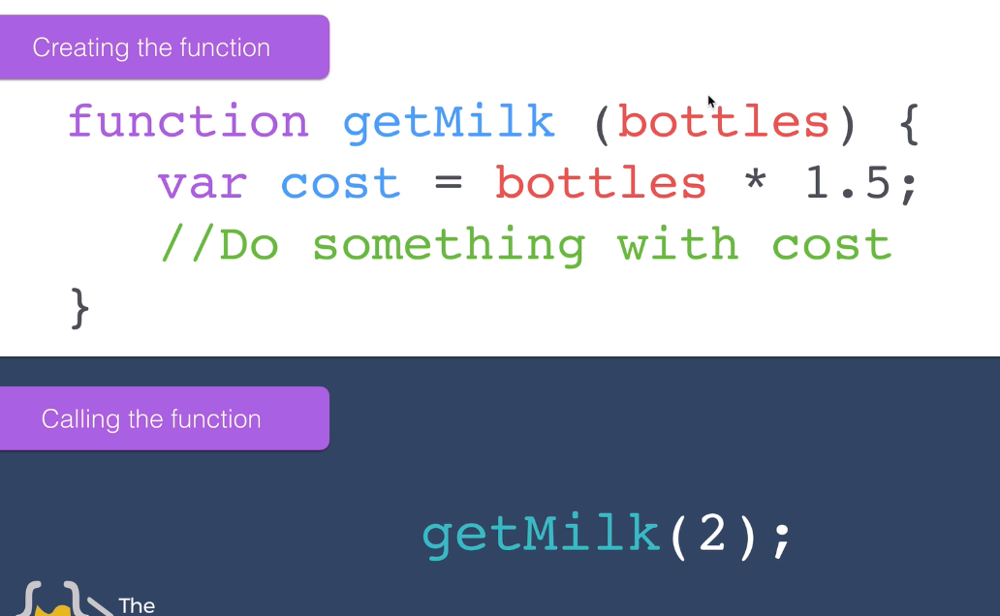
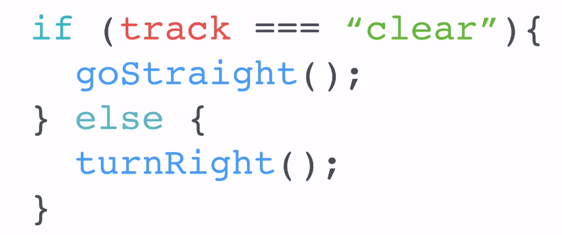

# JavaScript Notes

## Table of Contents

- [Difference Between Interpreter and Compiler](#difference-between-interpreter-and-compiler-video)
- [Data Types](#data-types)
  1. [Strings](#1-strings)
  2. [Numbers](#2-numbers)
  3. [Boolean](#3-boolean)
  4. [Arrays](#4-arrays)
- [Variables](#variables)
- [Functions](#functions)
- [If and Else](#if-and-else)
- [Loops](#loops)
  1. [While Loops](#1-while-loops)
  2. [For Loops](#2-for-loops)

### Difference between interpreter and Compiler [video](https://www.youtube.com/watch?v=_C5AHaS1mOA)

- JavaScript is an interpreter

- This is how JS code look like:

  

### Data Types:

#### 1. Strings:

- It contains text. This is how it looks like:

  ```javascript
  alert("hello"); // "hello" is the string data.
  ```

- Strings Concatenation:

  ```javascript
  var message = "Hello";
  var name = "Carlos";

  //Write you code below this line:

  alert(message + " " + name + "!"); // Outputs in Console: Hello Carlos!
  ```

- String feature `.length` challenge answer:

  (Create an alert that shows how many characters we typed and how many left after 280 characters.)

  ```javascript
  var text = prompt("Enter your Text here");
  var numberOfText = text.length;
  var remaining = 280 - numberOfText;

  alert(
    "You have written " +
      numberOfText +
      " characters, you have " +
      remaining +
      " left."
  );
  ```

- Feature `.slice(x,y)` challenge answer:

  (Create an alert that shows a max of 140 characters)

  ```javascript
  var text = prompt("Enter your text here");
  alert(text.slice(0, 140));
  ```

- Feature `.toUppercase()` and `.toLowerCase()` methods challenge answers:

  (Create an alert that shows the name of the person in the correct form Example: Carlos OR Bracho)

  ```javascript
  var name = prompt("What is your name?");
  firstLetter = name.slice(0, 1).toUpperCase();
  remainingLetters = name.slice(1, name.length).toLowerCase();

  alert("Hello, " + firstLetter + remainingLetters + " !");
  ```

#### 2. Numbers:

- It represents numerical values.

```javascript
1,2,3... // These are numbers data.
```

- To put long formulas in JS, we need to use the same logic as calculators.

  (Create an alert that calculates the age of dogs in human years)

  ```javascript
  var dogAge = prompt("Enter your dog's age");
  var humanAge = (dogAge - 2) * 4 + 21;
  alert("Your dog is " + humanAge + " in human years !");
  ```

- We can increment or decrement values by 1 using `++` and `--`.

  Example:

  ```javascript
  var x = 5;
  x++; //x is now = 6
  var y = 5;
  y--; //y is now = 4
  ```

- If we want to increase or decrease by more than 1, we can use `+=` or `-=` operators.

  Example:

  ```javascript
  var x = 5;
  x += 2; //x is now = 7
  var y = 5;
  y -= 2; //y is now = 3
  ```

#### 3. Boolean:

- Data type that describe data to be either `True` or `False`

#### 4. Arrays:

- A collection of items separated by commas enclosed within square brackets `[ ]`, with each item called an element.
- It could look like this:
  ```javascript
  var names = [Tom, Jerry, Spike];
  ```
  - To access elements of an array you need to specify the index number.
    ```javascript
    var myList = names[1]; // This returns Jerry
    ```
- We can count how many items are in an array by using `.length`.
- We can also use `.includes(value)` method to see if an array has an specific `value`. If it does it will return `true`, and if it doesn't, it will return `false`.

  - Example of using an array to create a list that detects if someone is in a party list:

    ```javascript
    var myList = ["Carlos", "Camille", "Vanessa", "Veronica"];

    var name = prompt("What is your name");

    if (myList.includes(name)) {
      alert("Hello " + name + ", welcome to the Party");
    } else {
      alert("Sorry, you are not on our list.");
    }
    ```

- We can add Items to arrays using the `.push()` method. Keep in mind that the value we put inside the brackets will be added at the end of the array. We can also delete the last item from an array using the `.pop` method.

  - Example of the `.push()` method using the FizzBuzz problem: Create a program that creates an array from 1 to 15. for each number divisible by 3 write "Fizz" and if it is divisible by 5, write "Buzz". If it is divisible by both, write "FizzBuzz".

    Answer:

    ```javascript
    var output = [];
    var count = 1;
    function fizzBuzz() {
      if (count % 3 === 0 && count % 5 === 0) {
        output.push("FizzBuzz");
      } else if (count % 3 === 0) {
        output.push("Fizz");
      } else if (count % 5 === 0) {
        output.push("Buzz");
      } else {
        output.push(count);
      }
      count++;
      console.log(output);
    }
    ```

- Arrays exercise: write a function which will select a random name from a list of names.

  ```Javascript
  function whosPaying(names) {
    var numberOfPeople = names.length;
    var randomPersonPosition = Math.floor(Math.random() * numberOfPeople);
    var randomPerson = names[randomPersonPosition];

    return randomPerson + " is goint to buy lunch today!";
  }
  ```

### Variables:



- Example of variable:

  ```javascript
  var myName = "Carlos";
  var yourName = prompt("What is your name?");
  alert(
    "My name is " +
      myName +
      ", welcome to this learning project " +
      yourName +
      " !"
  ); //This code creates a message  box with a personalized greeting. Which shows how  we can use variables in alerts.
  ```

- Javascript Variables Exercise:

  Change the variables so a = "8" and b = "3".

  Do NOT change any of the existing code.

  You are NOT allowed to type any numbers.

  You should NOT redeclare the variables a and b.

  ```javascript
  var a = "3";
  var b = "8";

  /***********Do not change the code above 👆*******/
  //Write your code on lines 7 - 9:
  var c = a;
  a = b;
  b = c;
  /***********Do not change the code below 👇*******/

  console.log("a is " + a);
  console.log("b is " + b);
  //this changes the values so a = "8" and b = "3"
  ```

- Correct ways to name variables in JS:

  ```javascript
  var my123 = 123;
  var myName = "Carlos";
  var my_name = "Carlos";
  var useScoreFinal = 12; // This is the best way because it includes camelCase.
  ```

### Functions:


- `alert()` will show as a pop up on the website while `console.log()` will print out the message in the console, and it is usually used by the developer.

- `prompt()` Will create a pop up in which we can enter values.

- Within the the functions, we can add inputs:

  ```javascript
  function nameOfFunction(input) {}
  ```

  This is an example:
  

  As we can see bottles will be replaced by two, telling the program to get two bottles and calculating the `cost`

  - Exercise: Using this information, create a code that calculates the amount of bottles that can be bought.

  ```javascript
  function getMilk(money) {
    console.log("leaveHouse");
    console.log("moveRight");
    console.log("moveRight");
    console.log("moveUp");
    console.log("moveUp");
    console.log("moveUp");
    console.log("moveUp");
    console.log("moveRight");
    console.log("moveRight");

    var bottles = Math.floor(money / 1.5);

    console.log("buy " + bottles + " bottles of milk");
    console.log("moveLeft");
    console.log("moveLeft");
    console.log("moveDown");
    console.log("moveDown");
    console.log("moveDown");
    console.log("moveDown");
    console.log("moveLeft");
    console.log("moveLeft");
    console.log("enterHouse");
  }
  getMilk(5);
  ```

- The `Math.floor()` method rounds a number _DOWN_ to the nearest integer; however, `Math.round()` is more Mathematically correct.

- Exercise: Calculate the remaining months, weeks and days if the max age is 90.

  ```javascript
  function lifeInWeeks(age) {
    /************Don't change the code above************/

    var remainingYears = 90 - age;

    var months = remainingYears * 12;
    var weeks = remainingYears * 52;
    var days = remainingYears * 365;

    console.log(
      "You have " +
        days +
        " days, " +
        weeks +
        " weeks, and " +
        months +
        " months left."
    );

    /*************Don't change the code below**********/
  }

  lifeInWeeks(25);
  ```

  console View:

  ```console
  You have 23725 days, 3380 weeks, and 780 months left.
  ```

- the `return` value is used in function to end the execution of a function and give back a result.

  - This is an example that shows the use of `return`.

    ```javascript
    function getMilk(money) {
      console.log("leaveHouse");
      console.log("moveRight");
      console.log("moveRight");
      console.log("moveUp");
      console.log("moveUp");
      console.log("moveUp");
      console.log("moveUp");
      console.log("moveRight");
      console.log("moveRight");

      var bottles = Math.floor(money / 1.5);

      console.log("buy " + bottles + " bottles of milk");
      console.log("moveLeft");
      console.log("moveLeft");
      console.log("moveDown");
      console.log("moveDown");
      console.log("moveDown");
      console.log("moveDown");
      console.log("moveLeft");
      console.log("moveLeft");
      console.log("enterHouse");

      return money % 1.5; // Remainder of this division
    }
    var change = getMilk(4);
    console.log(change); // This will show the remainder in the console
    ```

- Coding exercise: Create BMI calculator using functions.

  ```javascript
  //Create your function below this line.
  //The first parameter should be the weight and the second should be the height.

  function bmiCalculator(weight, height) {
    var bmi = weight / (height * height);
    return Math.round(bmi);
  }

  console.log(bmiCalculator(65, 1.8));

  /* If my weight is 65Kg and my height is 1.8m, I should be able to call your function like this:
  
   var bmi = bmiCalculator(65, 1.8); 
  
   bmi should equal 20 when it's rounded to the nearest whole number.
  
   */
  ```

- `Math.random()` generates a random 16 digit decimal number between 0 and 0.9999999999999999 (It never reaches 1). Example: 0.364738274631829

  - Exercise using `Math.random()`: Create a Love Calculator in whic we enter two prompts for names and calculate a Random number that is a percentage.

    ```javascript
    var loveCalc = Math.round(Math.random() * 100 + 1); //It it important to add + 1 so it takes the value of 100 too.

    prompt("Enter your name");
    prompt("Enter the name of the person you love");
    alert("You are " + loveCalc + "% compatible");
    ```

### If and Else:

- `if` and `else` keywords are used in functions to tell JavaScript what to do if a certain condition is met.

  - This is an Example of how `if` and `else` look like:

    

  - As an example, We can use it in the Love Calculator above:

    ```Javascript
    var loveCalc = Math.round(Math.random() * 100 + 1);

    prompt("Enter your name");
    prompt("Enter the name of the person you love");

    if (loveCalc > 70) {
      alert(
        "You are " +
          loveCalc +
          "% compatible. You love each other like Kanye loves Kanye."
      );
    } else {
      alert("You are " + loveCalc + "% compatible.");
    }
    ```

- List of comparators and equality used with `if`:

  1. `===`: Is equal to.
  2. `!==`: Is not equal to.
  3. `<`: Is less than.
  4. `>`: Is greater than
  5. `<=`: Is less or equal to.
  6. `>=`: Is great or equal to.

  - If we want to combine operators we need to use the following:

    1. `&&`: AND.
    2. `||`: OR.
    3. `!`: NOT.

  - Example of combining operator using the Love Calculator:

    ```javascript
    var loveCalc = Math.round(Math.random() * 100 + 1);

    prompt("Enter your name");
    prompt("Enter the name of the person you love");

    if (loveCalc > 70) {
      alert(
        "You are " +
          loveCalc +
          "% compatible. You love each other like Kanye loves Kanye."
      );
    }
    if (loveCalc > 30 && loveCalc <= 70) {
      alert("You are " + loveCalc + "% compatible.");
    }
    if (loveCalc <= 30) {
      alert(
        "You are " +
          loveCalc +
          "% compatible. You go together like oil and water."
      );
    }
    ```

- Coding challenge: Create a function that calculates leap year.

  ```JavaScript
  function isLeap(year) {
  /**************Don't change the code above****************/

  if (year % 4 === 0) {
    if (year % 100 === 0) {
      if (year % 400 === 0) {
        return "Leap year.";
      } else {
        return "Not leap year.";
      }
    } else {
      return "Leap year.";
    }
  } else {
    return "Not leap year.";
  }

  /**************Don't change the code below****************/
  }

  console.log(isLeap(2400));
  ```

### Loops

#### 1. While loops:

- It will run until condition is not true.
  ```javascript
  while(something is true){
    // Do something
  }
  ```
- Example of while loops using the FizzBuzz problem:

  ```javascript
  var output = [];
  var count = 1;
  function fizzBuzz() {
    while (count <= 15) {
      if (count % 3 === 0 && count % 5 === 0) {
        output.push("FizzBuzz");
      } else if (count % 3 === 0) {
        output.push("Fizz");
      } else if (count % 5 === 0) {
        output.push("Buzz");
      } else {
        output.push(count);
      }
      count++;
      console.log(output);
    }
  }
  ```

- Coding challenge: Create a program that prints the lyrics of [The Song 99 Bottles of Beer](https://www.99-bottles-of-beer.net/lyrics.html)

  ```javascript
  var numberOfBottles = 99;
  while (numberOfBottles >= 0) {
    var bottleWord = "bottle";
    if (numberOfBottles === 1) {
      bottleWord = "bottles";
    }
    console.log(numberOfBottles + " " + bottleWord + " of beer on the wall");
    console.log(numberOfBottles + " " + bottleWord + " of beer,");
    console.log("Take one down, pass it around,");
    numberOfBottles--;
    console.log(numberOfBottles + " " + bottleWord + " of beer on the wall.");
  }
  ```

#### 2. For Loops:

- Works similarly to `while` loops, but we specify the amount of times we want the loop to run.
- `while` loops check for a state and the `for` loops look for an iteration.

  ```javascript
  for (i = 0; i < 2; i++) {
    //Do something
  }
  ```

  `i = 0` is the starting point.

  `i < 2` is the condition or ending point.

  `i++` is the change in value after each iteration.

- For loops make it a little bit easier to create loops.
- Coding Challenge: Create a fibonacci function Generator [See this link tyo learn what fibonacci is](https://en.wikipedia.org/wiki/Fibonacci_sequence):

  ```javascript
  function fibonacciGenerator(n) {
    var output = [];
    if (n === 1) {
      output = [0];
    } else if (n === 2) {
      output = [0, 1];
    } else {
      output = [0, 1];
      for (var i = 2; i < n; i++) {
        output.push(output[output.length - 2] + output[output.length - 1]);
      }
    }

    return output;
  }
  ```
