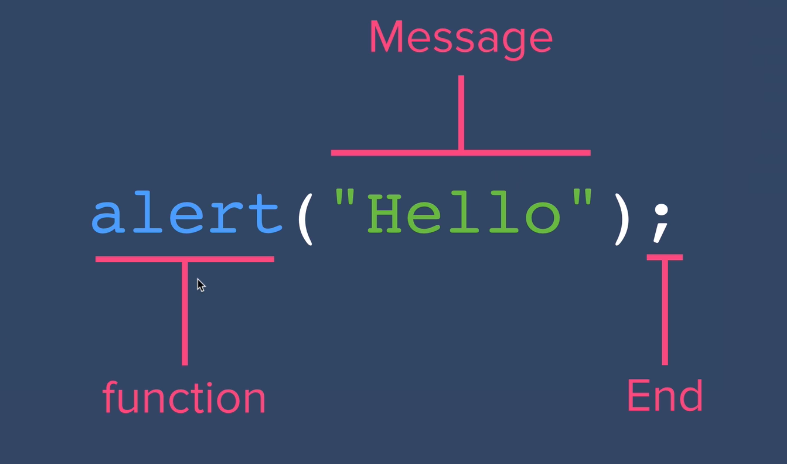

# Notes From Dr. Angela Yu's Course (The Complete 2024 Web Development Bootcamp)

## Section 14 | Introduction to Javascript ES6

### Difference between interpreter and Compiler [video](https://www.youtube.com/watch?v=_C5AHaS1mOA)

- JavaScript is an interpreter

- This is how JS code look like:

  

## Data Types:

### 1. Strings: It contains text.

```javascript
alert("hello"); // "hello" is the string data.
```

- Strings Concatenation:

  ```javascript
  var message = "Hello";
  var name = "Carlos";

  //Write you code below this line:

  alert(message + " " + name + "!"); // Outputs in Console: Hello Carlos!
  ```

- String feature `.length` challenge answer:

  (Create an alert that shows how many characters we typed and how many left after 280 characters.)

  ```javascript
  var text = prompt("Enter your Text here");
  var numberOfText = text.length;
  var remaining = 280 - numberOfText;

  alert(
    "You have written " +
      numberOfText +
      " characters, you have " +
      remaining +
      " left."
  );
  ```

- Feature `.slice(x,y)` challenge answer:

  (Create an alert that shows a max of 140 characters)

  ```javascript
  var text = prompt("Enter your text here");
  alert(text.slice(0, 140));
  ```

- Feature `.toUppercase()` and `.toLowerCase()` methods challenge answers:

  (Create an alert that shows the name of the person in the correct form Example: Carlos OR Bracho)

  ```javascript
  var name = prompt("What is your name?");
  firstLetter = name.slice(0, 1).toUpperCase();
  remainingLetters = name.slice(1, name.length).toLowerCase();

  alert("Hello, " + firstLetter + remainingLetters + " !");
  ```

### 2. Numbers: It represents numerical values.

```javascript
1,2,3... // These are numbers data.
```

- To put long formulas in JS, we need to use the same logic as calculators.

  (Create an alert that calculates the age of dogs in human years)

  ```javascript
  var dogAge = prompt("Enter your dog's age");
  var humanAge = (dogAge - 2) * 4 + 21;
  alert("Your dog is " + humanAge + " in human years !");
  ```

- We can increment or decrement values by 1 using `++` and `--`.

  Example:

  ```javascript
  var x = 5;
  x++; //x is now = 6
  var y = 5;
  y--; //y is now = 4
  ```

- If we want to increase or decrease by more than 1, we can use `+=` or `-=` operators.

  Example:

  ```javascript
  var x = 5;
  x += 2; //x is now = 7
  var y = 5;
  y -= 2; //y is now = 3
  ```

### 3. Boolean: Data type that describe data to be either `True` or `False`

## Variables:


Example of variable:

```javascript
var myName = "Carlos";
var yourName = prompt("What is your name?");
alert(
  "My name is " +
    myName +
    ", welcome to this learning project " +
    yourName +
    " !"
); //This code creates a message  box with a personalized greeting. Which shows how  we can use variables in alerts.
```

### Javascript Variables Exercise:

Change the variables so a = "8" and b = "3".

Do NOT change any of the existing code.

You are NOT allowed to type any numbers.

You should NOT redeclare the variables a and b.

```javascript
var a = "3";
var b = "8";

/***********Do not change the code above 👆*******/
//Write your code on lines 7 - 9:
var c = a;
a = b;
b = c;
/***********Do not change the code below 👇*******/

console.log("a is " + a);
console.log("b is " + b);
//this changes the values so a = "8" and b = "3"
```

### Correct ways to name variables in JS:

```javascript
var my123 = 123;
var myName = "Carlos";
var my_name = "Carlos";
var useScoreFinal = 12; // This is the best way because it includes camelCase.
```
